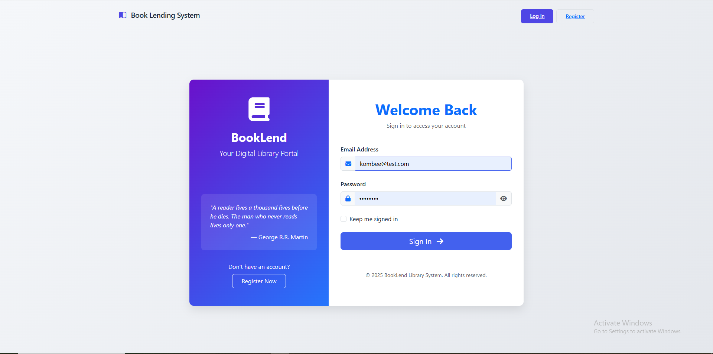
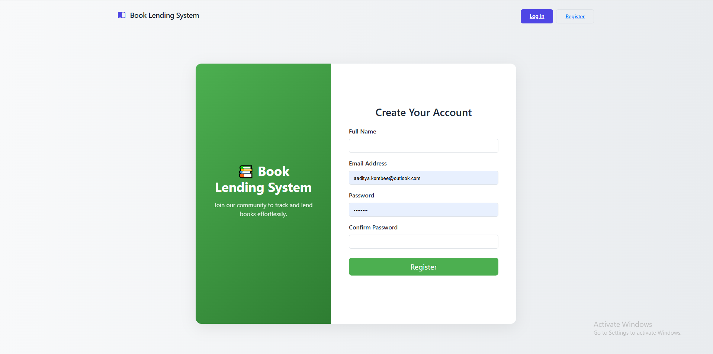
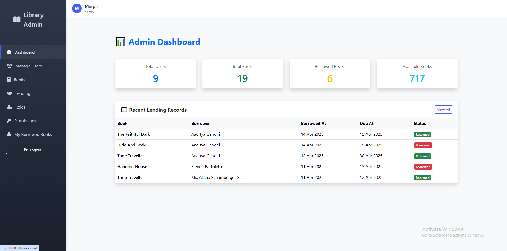
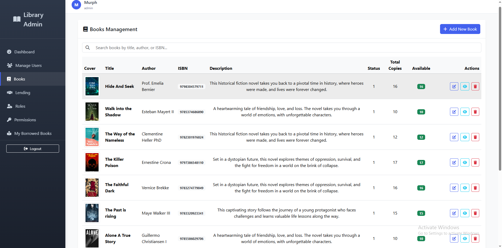
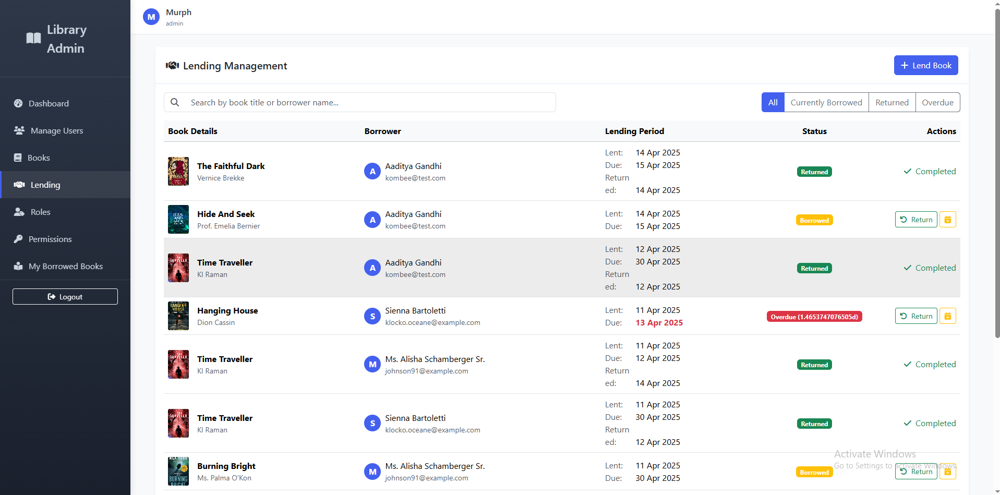
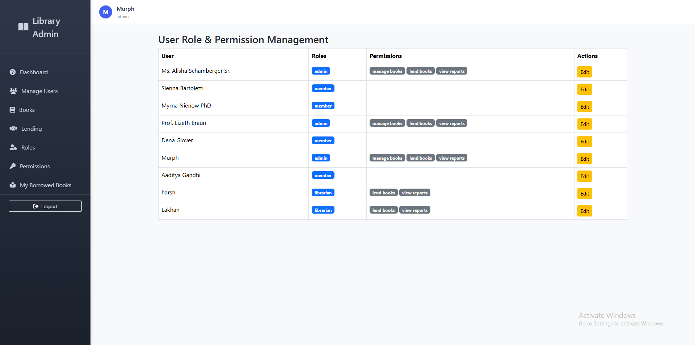
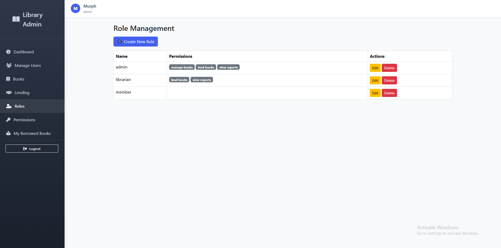

# 📚 Book Lending System

A modern web-based Book Lending System built with Laravel and Tailwind CSS. This system allows administrators to manage users and books, track borrowings and returns, and provides a user-friendly interface for library members to request and return books.

---

## 🚀 Introduction

**BookLend** The Book Lending System is a full-featured Laravel web application that allows users to borrow books, manage returns, and track records with ease. It includes an intuitive admin dashboard, user management, and access control using Laravel Passport and Spatie Permission.

Whether you're running a small community library or just organizing your personal collection, BookLend simplifies the lending process with ease and style.

---

## ✨ Features

- ✅ Authentication with Laravel Passport
- ✅ Role & Permission Management using Spatie
- ✅ Responsive Admin Dashboard
- ✅ User Management (create, update, suspend, delete)
- ✅ Book Inventory Management (add, update, remove books)
- ✅ Borrowing System (borrow/return tracking with dates)
- ✅ Search, Sort & Filter
- ✅ Notification system with Toastr
- ✅ Fully mobile responsive (Tailwind CSS)

---

## 🛠️ Tech Stack

| Technology       | Description                               |
|------------------|-------------------------------------------|
| **Laravel 10+**  | PHP framework for backend and routing     |
| **Laravel Passport** | API authentication system           |
| **Spatie Permission** | Role-based access control           |
| **Livewire**     | Reactive components without JS            |
| **Tailwind CSS** | Utility-first CSS framework               |
| **Bootstrap Icons** | Beautiful icon system                 |
| **Vite**         | Fast asset bundling                       |
| **MySQL**        | Database                                 |

---

## 🖼️ Screenshots

### 📌 Login Page



---

### 📌 Register Page



---


### 📌 Dashboard (Admin View)



---

### 📌 Manage Books



---

### 📌 Borrowing Tracker



---

### 📌 Access Control



---

### 📌 Role Management



---

## 📁 Full Project Structure

```text
├── app/
│   ├── Http/
│   │   ├── Controllers/
│   │   │   ├── Api/
│   │   │   └── Web/
│   │   │       ├── AdminDashboardController.php
│   │   │       ├── AuthFormController.php
│   │   │       ├── BookController.php
│   │   │       ├── Controller.php
│   │   │       ├── DashboardController.php
│   │   │       ├── LendingController.php
│   │   │       ├── RoleController.php
│   │   │       ├── UserController.php
│   │   │       └── UserRolePermissionController.php
│   │   ├── Requests/
│   │   │   ├── LoginRequest.php
│   │   │   ├── RegisterRequest.php
│   │   │   ├── StoreBookRequest.php
│   │   │   ├── StoreLendingRequest.php
│   │   │   ├── StoreUserRequest.php
│   │   │   ├── UpdateBookRequest.php
│   │   │   └── UpdateUserRequest.php
│   ├── Models/
│   │   ├── Book.php
│   │   ├── LendingRecord.php
│   │   └── User.php
│   └── Providers/
│       └── AppServiceProvider.php

├── bootstrap/
├── config/

├── database/
│   ├── factories/
│   │   ├── BookFactory.php
│   │   ├── LendingRecordFactory.php
│   │   └── UserFactory.php
│   ├── migrations/
│   └── seeders/
│       ├── BookSeeder.php
│       ├── DatabaseSeeder.php
│       ├── LendingRecordSeeder.php
│       └── RolePermissionSeeder.php

├── public/

├── resources/
│   ├── css/
│   ├── js/
│   └── views/
│       ├── admin/
│       │   ├── roles/
│       │   │   ├── create.blade.php
│       │   │   ├── edit.blade.php
│       │   │   └── index.blade.php
│       │   └── user_roles/
│       │       ├── dashboard.blade.php
│       │       ├── edit.blade.php
│       │       └── index.blade.php
│       ├── auth/
│       │   ├── login.blade.php
│       │   └── register.blade.php
│       ├── books/
│       │   ├── _form.blade.php
│       │   ├── create.blade.php
│       │   ├── edit.blade.php
│       │   └── index.blade.php
│       ├── layouts/
│       │   ├── app.blade.php
│       │   └── auth.blade.php
│       ├── lendings/
│       │   ├── create.blade.php
│       │   ├── index.blade.php
│       │   └── my_books.blade.php
│       ├── users/
│       │   ├── borrowings.blade.php
│       │   ├── create.blade.php
│       │   ├── edit.blade.php
│       │   ├── index.blade.php
│       │   └── show.blade.php
│       └── welcome.blade.php

├── routes/
│   ├── api.php
│   ├── console.php
│   └── web.php

├── storage/
│   ├── app/
│   ├── framework/
│   ├── logs/
│   ├── oauth-private.key
│   └── oauth-public.key

├── tests/
├── vendor/

├── .editorconfig
├── .env
├── .env.example
├── .gitattributes
├── .gitignore
├── artisan
├── composer.json
├── composer.lock
└── README.md
  ```

## 📦 Installation

**Clone the repository**
 ```bash
git clone https://github.com/Aaditya77700/demo-app.git
cd book-lending-system
 ```
**Install dependencies**
 ```bash
composer install
npm install && npm run dev
 ```
**Set up your environment**
 ```bash
cp .env.example .env
php artisan key:generate
 ```
**Configure database in .env file**
**Edit your .env file with these database credentials**
DB_CONNECTION=mysql
DB_HOST=127.0.0.1
DB_PORT=3306
DB_DATABASE=book_lending_db
DB_USERNAME=your_username
DB_PASSWORD=your_password
 
**Run migrations**
 ```bash
php artisan migrate
 ```
**Install and configure Laravel Passport**
 ```bash
composer require laravel/passport
php artisan migrate
php artisan passport:install
php artisan passport:client --personal
 ```
**Serve the application**
 ```bash
php artisan serve
Visit http://localhost:8000 to start using your Book Lending System.
 ```
1. **Clone the repo:**
   ```bash
   git clone https://github.com/Aaditya77700/demo-app.git
   cd book-lending-system
     ```

## 🤝 Contributing
Contributions are welcome! Please fork this repository and submit a pull request.
     ```
## 📄 License
This project is licensed under the MIT License. See the LICENSE file for details.
    ```

